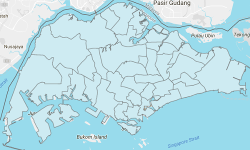
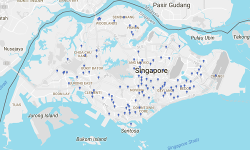

# sg-heatmap

Open-source all-in-one Swiss Army knife tool for creating Choropleth maps


## Motivation

How do you generate a Choropleth map?

##### Step 1:
First get a bunch of polygons



##### Step 2:
Then get a ton of location data points



##### Step 3:
Assign each data point to an area (i.e. binning)

##### Step 4:
Aggregate the data points in each bin (area) with an aggregating function (eg. count, mean, median)

##### Step 5:
Map each bin's aggregated value to a color using a color scale

##### Step 6:
Render the colored polygons onto Google map

##### Step 7:
Received a new set of data points? Repeat Step 3 to Step 6

Clearly generating a Choropleth is not an easy task. Our goal is to provide a simple yet highly customizable JavaScript tool for data enthusiast to spend less time engineering and more time building beautiful visualizations.

## A basic example
```javascript
import SgHeatmap from 'sg-heatmap/dist/predefined/URA_subzone'
import {register_MEAN} from 'sg-heatmap/dist/helpers'
import {Spectral} from 'sg-heatmap/dist/helpers/color'

import dataPoints from './dataPoints.json'

// initialize heatmap
var heatmap = new SgHeatmap( )

// set up heatmap to use MEAN for aggregating
register_MEAN(heatmap)

// pass in the data points
// binning and aggregating is done in one step
dataPoints.forEach(pt => {
  heatmap.update([pt.lng, pt.lat], pt.wt)
})

// retrieve aggregated values
var stat = heatmap.getStat('mean')

// initialize color scale
// supply domain min and max endpoints for linear mapping
var colorScale = Spectral([stat.min, stat.max])

// initialize renderer
var renderer = heatmap.initializeRenderer({
  strokeWeight: 1,
  strokeColor: 'black',
  strokeOpacity: 1,
  fillColor: 'white',
  fillOpacity: 0.7
})
renderer.setMap(googleMap)

// render
heatmap.render('mean', colorScale)
```

## Binning by key / Working with pre-aggregated data
Sometimes we might be working with pre-aggregated data.
Instead of binning and updating with the location (lnglat),
you want to bin directly to each polygon using keys.
In this case we provides a helper function to modify your *SgHeatmap* object

```javascript
import {insideByKey} from 'sg-heatmap/dist/helpers'
import aggregatedData from './aggregatedData.json'

insideByKey(heatmap)
aggregatedData.forEach(pt => {
  heatmap.update(pt.keys, pt.wt)
})
```

One potential use case is doing the
(relatively time-consuming) binning and aggregating server-side
and send only the aggregated values to the client for rendering

```javascript
// Server-side
import SgHeatmap from 'sg-heatmap/dist/predefined/URA_subzone'
import {register_MEAN} from 'sg-heatmap/dist/helpers'
import dataPoints from './dataPoints'

var heatmap = new SgHeatmap()
register_MEAN(heatmap)

dataPoints.forEach(pt => {
  heatmap.update([pt.lng, pt.lat], pt.wt)
})

var stat = heatmap.getStat('mean')
// Send 'stat' object to client
```

```javascript
// Client-side
import SgHeatmap from 'sg-heatmap/dist/predefined/URA_subzone'
import {register_LATEST} from 'sg-heatmap/dist/helpers'

var heatmap = new SgHeatmap()
register_LATEST(heatmap)

// Receive 'stat' object from server
Object.keys(stat.values).forEach(key => {
  heatmap.update([key], stat.values[key])
})

// initialize renderer
// initialize colorScale...

// call render on stat 'latest'
heatmap.render('latest', colorScale)
```

## NEW Plugin to support LeafletJS
```javascript
import SgHeatmap from 'sg-heatmap/dist/predefined/URA_subzone'
import supportLeaflet from 'sg-heatmap/dist/plugins/leaflet'
import {register_MEAN} from 'sg-heatmap/dist/helpers'
import {Spectral} from 'sg-heatmap/dist/helpers/color'

import dataPoints from './dataPoints.json'

var heatmap = new SgHeatmap( )
supportLeaflet(heatmap)
register_MEAN(heatmap)

dataPoints.forEach(pt => {
  heatmap.update([pt.lng, pt.lat], pt.wt)
})

var stat = heatmap.getStat('mean')
var colorScale = Spectral([stat.min, stat.max])

// .initializeRenderer( ) has been overridden to
// return a Leaflet GeoJSON layer
// refer to http://leafletjs.com/reference-1.0.0.html#geojson
var renderer = heatmap.initializeRenderer({
  weight: 1,
  color: 'black',
  opacity: 1,
  fillColor: 'white',
  fillOpacity: 0.7
})
renderer
  .bindTooltip(layer => layer.feature.properties.Subzone_Name)
  .addTo(leafletMap)

heatmap.render('mean', colorScale)
```

## NEW Plugin to support OpenLayers
```javascript
import SgHeatmap from 'sg-heatmap/dist/predefined/URA_subzone'
import supportOpenLayers from 'sg-heatmap/dist/plugins/openlayers'
import {register_MEAN} from 'sg-heatmap/dist/helpers'
import {Spectral} from 'sg-heatmap/dist/helpers/color'

import dataPoints from './dataPoints.json'

var heatmap = new SgHeatmap( )
supportOpenLayers(heatmap)
register_MEAN(heatmap)

dataPoints.forEach(pt => {
  heatmap.update([pt.lng, pt.lat], pt.wt)
})

var stat = heatmap.getStat('mean')
var colorScale = Spectral([stat.min, stat.max])

// defaultStyle and addonStyle need to be OpenLayers ol.style.Style object
var defaultStyle = new ol.style.Style({
  stroke: new ol.style.Stroke({
    color: 'black',
    width: 1
  }),
  fill: new ol.style.Fill({
    color: 'white'
  })
})

// .initializeRenderer( ) has been overridden to
// return an OpenLayers ol.layer.Vector object
// refer to http://openlayers.org/en/latest/apidoc/ol.layer.Vector.html
var renderer = heatmap.initializeRenderer(defaultStyle)
renderer.setOpacity(0.7)
openLayersMap.addLayer(renderer)

heatmap.render('mean', colorScale)
```

## API Documentation

#### Installing
```
npm install --save sg-heatmap
```

#### Importing to project
```javascript
import SgHeatmap from 'sg-heatmap'
// OR in ES5
var SgHeatmap = require('sg-heatmap')
```

#### Using predefined maps with polygon data loaded
```javascript
import SgHeatmap from 'sg-heatmap/dist/predefined/URA_region'
// OR
import SgHeatmap from 'sg-heatmap/dist/predefined/URA_planning_area'
// OR
import SgHeatmap from 'sg-heatmap/dist/predefined/URA_subzone'

// initialize
var heatmap = new SgHeatmap()
```

Data source:
- https://data.gov.sg/dataset/master-plan-2014-region-boundary-web
- https://data.gov.sg/dataset/master-plan-2014-planning-area-boundary-web
- https://data.gov.sg/dataset/master-plan-2014-subzone-boundary-web

#### Defining map with your own polygon data
```javascript
import polygonData from './polygonData.json'

var heatmap = new SgHeatmap(polygonData.features)
```

#### Polygon data must takes the format of an array of GeoJSON feature objects
```javascript
Position: [Number, Number]
// first element longitude
// second element latitude

LinearRing: Array<Position>
// first position to match last position

Polygon: {
  type: 'Polygon',
  coordinates: Array<LinearRing>, // required
  // first element is outer boundary
  // second element onward are inner "holes"
  bbox: [Number, Number, Number, Number] // optional
  // first element West bound, second element South bound
  // third element East bound, fourth element North bound
}

MultiPolygon: {
  type: 'MultiPolygon',
  coordinates: Array<Array<LinearRing>>,
  bbox: [Number, Number, Number, Number]
}

Feature: {
  type: 'Feature'
  id: String, // required, must be unique
  properties: Object, // optional, meta data in key/value form
  geometry: Polygon | MultiPolygon // required
}

polygonData: Array<Feature>
```

Refer to relevant sections in **IETF's 2015 GeoJSON Specification (RFC7946)**
- [https://tools.ietf.org/html/rfc7946#section-3.2](https://tools.ietf.org/html/rfc7946#section-3.2)
- [https://tools.ietf.org/html/rfc7946#section-3.1.6](https://tools.ietf.org/html/rfc7946#section-3.1.6)
- [https://tools.ietf.org/html/rfc7946#section-3.1.7](https://tools.ietf.org/html/rfc7946#section-3.1.7)
- [https://tools.ietf.org/html/rfc7946#section-3.1.1](https://tools.ietf.org/html/rfc7946#section-3.1.1)
- [https://tools.ietf.org/html/rfc7946#section-5](https://tools.ietf.org/html/rfc7946#section-5)

#### Defining the aggregating function
```javascript
import {register_MEAN} from 'sg-heatmap/dist/helpers'

// this step is required before passing in any data
register_MEAN(heatmap)
```

#### List of predefined aggregating function
- register_HISTORY
- register_LATEST
- register_COUNT
- register_SUM
- register_MEAN
- register_VARIANCE
- register_STDEV
- register_MIN
- register_MAX
- register_MEDIAN

*register_HISTORY* and *register_LATEST* does not do any actual aggregating

*register_HISTORY* simply push data point to an array in the update order while

*register_LATEST* replaces old value with each update and keeps only the latest data point

#### *.update( )* method
```javascript
import dataPoints from './dataPoints.json'

// push one data point
var pt = dataPoints[0]
heatmap.update([pt.lng, pt.lat], pt.wt)

// push another data point
pt = dataPoints[1]
heatmap.update([pt.lng, pt.lat], pt.wt)

// push the remaining data points
dataPoints.slice(2).forEach(pt => {
  heatmap.update([pt.lng, pt.lat], pt.wt)
})
```

This design supports streaming data. Each time *.update( )* is called, binning and aggregating is performed on the single data point. Therefore *.getStat( )* and *.render( )* can be called even without all data points loaded

```javascript
// eg.
heatmap.resetState()

dataPoints.slice(0, 100).forEach(pt => {
  heatmap.update([pt.lng, pt.lat], pt.wt)
})
heatmap.getStat('mean')
// returns aggregated values for first 100 data points

dataPoints.slice(100, 200).forEach(pt => {
  heatmap.update([pt.lng, pt.lat], pt.wt)
})
heatmap.getStat('mean')
// returns aggregated values for first 200 data points

dataPoints.slice(200, 300).forEach(pt => {
  heatmap.update([pt.lng, pt.lat], pt.wt)
})
heatmap.getStat('mean')
// returns aggregated values for first 300 data points


// say you only want to check which bin data point falls into
// i.e. bin but don't update
pt = dataPoints[0]
heatmap.bin([pt.lng, pt.lat])
// this returns filtered list of heatmap.children
// where inside function evaluates true

// to get their respective key
var matchingKeys = heatmap.bin([pt.lng, pt.lat])
  .map(child => child.key)
```

#### *.getStat( )* method
```javascript
// returns
var stat = getStat('mean') = {
  stat: String, // name of statistic queried (in this case 'mean')
  values: Object, // key/value map of aggregated stat for each child that has been matched to at least one data point
  unchanged: [String], // keys of children where no update (i.e. not matched to any data point)
  min: Number, // minimum among the set of values in stat.values
  max: Number // maximum among the set of values in stat.values
}
```

Each data point only needs to be passed in once and any number of statistics can be called on the SgHeatmap Object

```javascript
// eg.
import {
  register_MEAN, register_MAX, register_MIN
} from 'sg-heatmap/dist/helpers'

register_MEAN(heatmap)
register_MAX(heatmap)
register_MIN(heatmap)

dataPoints.forEach(pt => {
  heatmap.update([pt.lng, pt.lat], pt.weight)
})

heatmap.getStat('mean') // return MEAN
heatmap.getStat('max') // return MAX
heatmap.getStat('min') // return MIN
```

#### *.render( )* method
```javascript
// initialize renderer
heatmap.initializeRenderer(defaultStyle, addonStyle)

// initialize colorScale by providing domain min/max endpoints
heatmap.render(key, colorScale) // key is the name of the statistic to render
```

- *defaultStyle* and *addonStyle* are optional style options to be applied onto map polygons
- refer to [https://developers.google.com/maps/documentation/javascript/3.exp/reference#Data.StyleOptions](https://developers.google.com/maps/documentation/javascript/3.exp/reference#Data.StyleOptions)
- *defaultStyle* applies to every polygon (including those in the unchanged group)
- *addonStyle* applies to those polygons that has been assigned at least one data point
- do not set 'fillColor' in *addonStyle* as it will be overridden by the fillColor *colorScale* specify
- refer to next section for detail on the *colorScale* object

#### *colorScale* function
- *.render( )* method requires a colorScale function to be passed in as its second parameter.
- *colorScale* is any function that maps numeric values to CSS colors

```javascript
// example
colorScale(5) // returns 'orange'
colorScale(10) // returns '#ff0000'
```

#### Using predefined colorScale
```javascript
import {Spectral} from 'sg-heatmap/dist/helpers/color'

// hard coded domain
var colorScale = Spectral([5, 10])

// OR let data decides domain
var stat = getStat('mean')
var colorScale = Spectral([stat.min, stat.max])
```

Sometimes linear mapping of value to color
may not visibly separate the different values sufficiently
(eg. majority of values are clustered in the lower range)
In this case, we may want to apply a power transformation
to accentuate difference within certain part of the domain
All predefined colorScale accepts a second parameter for specifying power transformation

```javascript
// to accentuate difference in the lower range, set transformation < 1
var colorScale = Spectral([stat.min, stat.max], 0.5)

// to accentuate difference in the upper range, set transformation > 1
var colorScale = Spectral([stat.min, stat.max], 2)
```

#### List of predefined colorScale
- eg. Spectral, YlOrRd, Purples
- Refer to [COLORBREWER 2.0](http://colorbrewer2.org/) for the full set of color schemes available

#### Using colorScale helper function to generate customized colorScale
```javascript
import generateColorScale from 'sg-heatmap/dist/helpers/color'

var colorArray = ['white', 'yellow', 'orange', 'red', 'black']

var colorScaleOptions = {
  domain: [0, 1],
  transform: 1,
  bezierInterpolate: false,
  correctLightness: true,
  interpolationMode: 'lab'
}

var customColorScale = generateColorScale(colorArray, colorScaleOptions)
```

Refer to [chroma.js](https://gka.github.io/chroma.js/) docs for detail explanation of the different colorScaleOptions

## Advance Topics

#### Adding Event Handlers
```javascript
// eg.
var defaultStyle = {
  strokeOpacity: 0,
  fillOpacity: 0
}
var addonStyle = {
  strokeOpacity: 1,
  fillOpacity: 0.7
}
// by setting opacity 0, empty areas will be hidden

var renderer = heatmap.initializeRenderer(defaultStyle, addonStyle)
renderer.addListener('click', event => {
  var Address = event.feature.getProperty('Address')
  var Subzone_Name = event.feature.getProperty('Subzone_Name')
  console.log(Subzone_Name, Address)
})
```

Refer to
[https://developers.google.com/maps/documentation/javascript/3.exp/reference#Data.Feature](https://developers.google.com/maps/documentation/javascript/3.exp/reference#Data.Feature)
for details on the methods available on the *feature* object

```javascript
// you can even do this
// creates a highlight effect on hover
renderer.addListener('mouseover', event => {
  renderer.overrideStyle(event.feature, {fillOpacity: 0.5})
})
renderer.addListener('mouseout', event => {
  renderer.revertStyle(event.feature)
})
```

Refer to
[https://developers.google.com/maps/documentation/javascript/3.exp/reference#Data](https://developers.google.com/maps/documentation/javascript/3.exp/reference#Data)
for a detailed list of methods on the *renderer* object

```javascript
// Leaflet plugin example
var renderer = heatmap.initializeRenderer(defaultStyle, addonStyle)
renderer.on({
  click: event => {
    var Address = event.layer.feature.properties.Address
    var Subzone_Name = event.layer.feature.properties.Subzone_Name
    console.log(Subzone_Name, Address)
  },
  mouseover: event => {
    event.layer.setStyle({fillOpacity: 0.5})
  },
  mouseout: event => {
    renderer.resetStyle(event.layer)
  }
})
```

```javascript
// OpenLayers plugin example
var renderer = heatmap.initializeRenderer(defaultStyle, addonStyle)
var clickHandler = new ol.interaction.Select()
openLayersMap.on('click', event => {
  openLayersMap.forEachFeatureAtPixel(event.pixel, feature => {
    var Address = feature.get('Address')
    var Subzone_Name = feature.get('Subzone_Name')
    console.log(Subzone_Name, Address)
  })
})
```

#### Custom aggregate functions
When *.update( )* is called binning and aggregation is performed simultaneously. How does this work? How does the *SgHeatmap* object aggregate before being exposed to the full dataset.

*SgHeatmap* does this by using a reducer approach in aggregation. Those who has worked with *Redux.js* will be familiar with this approach.

Each child of the *SgHeatmap* object (corresponding to one feature) has a *state* object

```javascript
import SgHeatmap from 'sg-heatmap/dist/predefined/URA_subzone'

var heatmap = new SgHeatmap()

console.log(heatmap.children[0].state)
// prints empty object {}
```

To enable aggregation, first you need to define a default state on all the children by calling *.setDefaultState( )*.

```javascript
heatmap.setDefaultState({_count: 0, _sum: 0})
console.log(heatmap.children[0].state)
// prints {_count: 0, _sum: 0}
```

Then you register some updater functions by calling *.registerUpdater( )*. These *updaters* are reducer functions that requires two parameters *newValue* and *oldState* and returns a *newState* by performing some some update operations.

```javascript
// eg.
function countUpdater (newValue, oldState) {
  return {_count: oldState._count + 1}
}
function sumUpdater (newValue, oldState) {
  return {_sum: oldState._sum + newValue}
}
heatmap.registerUpdater(countUpdater)
heatmap.registerUpdater(sumUpdater)
heatmap.inspectUpdaters()
// prints a stringified version countUpdater and sumUpdater
```

The final step is to register a compute statistic function by calling *.registerStat( )*. *stat* functions takes in one argument *state* and returns a numeric statistic *value*. Only *stat* that has been registered are available to be called by the *.getStat( )* method.

```javascript
// eg.
function computeMean (state) {
  return state._sum / state._count
}
heatmap.registerStat('mean', computeMean)
heatmap.inspectStats()
// prints a stringified version of computeMean
```

To reset a heatmap and empty all it's data you can call *.resetState( )* and all the children's *state* will be reverted to the *defaultState*.

```javascript
heatmap.resetState()
console.log(heatmap.children[0].state)
// prints {_count: 0, _sum: 0}
```

If all these looks too complicated to you, just use one of the predefined aggregate functions. It should do everything for you. The predefined aggregate functions provided are more than enough for most use cases.

```javascript
import {register_MEAN} from 'sg-heatmap/dist/helpers'

register_MEAN(heatmap)
```

Another alternative (for those who have problems wrapping their head around to writing reducer functions) is to just use a *history* updater and rely solely on the *stat* function for aggregating.

```javascript
// eg.
import {register_HISTORY} from 'sg-heatmap/dist/helpers'

register_HISTORY(heatmap)

function computeMean (state) {
  var sum = state._history.reduce((s, v) => s + v, 0)
  var count = state._history.length
  return sum / count
}

registerStat('mean', computeMean)
```

The reducer design has a few advantages:
1. *SgHeatmap* object holds only the data needed for rendering the choropleth map instead of the entire dataset. If state needs to be passed around, you'll have a much smaller footprint.
2. Supports streaming data. You can do interesting things like say 'moving average'

```javascript
// eg. implementing moving average
heatmap.setDefaultState({_history: []})

function historyUpdater (newValue, oldState) {
  // clone history into new array
  var _history = [...state._history] // ES6 syntax
  if (_history.length === 10) {
    _history.shift( )
  }
  _history.push(newValue)
  return {_history: _history}
}

heatmap.registerUpdater(historyUpdater)

function computeMean (state) {
  var sum = state._history.reduce((s, v) => s + v, 0)
  var count = state._history.length
  return sum / count
}

registerStat('movingAverage', computeMean)
```

#### Cloning *SgHeatmap* object
```javascript
import SgHeatmap from 'sg-heatmap/dist/predefined/URA_subzone'

var oldHeatmap = new SgHeatmap()

// Method 1 (cloning locally)
var newHeatmap = oldHeatmap.clone(true)
// setting option false will clone only polygon data
// but not state object

// Method 2 (for sending data between server and client)
var serializedData = oldHeatmap.serialize(true)
var newHeatmap = new SgHeatmap(JSON.stringify(serializedData))
// as before, setting option false will clone only polygon data
```

Cloned *SgHeatmap* can retain original *state* of all its children but *updaters* and *stats* will still have to be re-registered

```javascript
import {register_MEAN} from 'sg-heatmap/dist/helpers'

register_MEAN(oldHeatmap)

var newHeatmap = oldHeatmap.clone(true)
newHeatmap.inspectUpdaters( ) // prints []
newHeatmap.inspectStats( ) // prints {}
newHeatmap.getStat('mean') // throws Error

// complete clone by
register_MEAN(newHeatmap)
```
